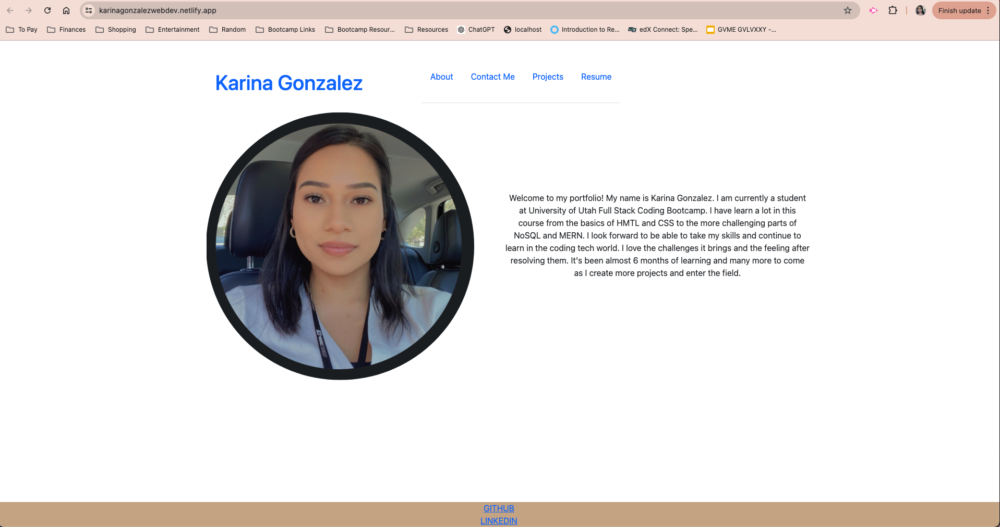

# Portfolio-React

## Description

This portfolio showcases 6 projects I have workedd on throughout my learning journey. I selected the 6 projects I think best show I can work front end and back end as well as the technologies and packages I have learned to use thus far. I created this portfolio using React and jsx to build a singles page application.

## Installation

Visit my Link 🙂 : https://karinagonzalezwebdev.netlify.app/

## Installation 

No Installation required, simply visit my portfolio link 🙂 : https://karinagonzalezwebdev.netlify.app/

## Usage

